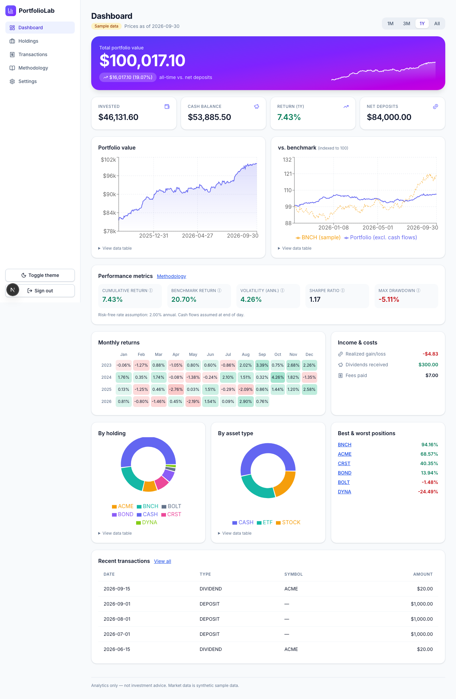

# PortfolioLab

PortfolioLab is a full-stack portfolio analytics app: record stock/ETF transactions (manually or via CSV), see holdings, cash and total value, chart value over time against a benchmark, and read clearly defined return/risk metrics. It is an engineering project, **not investment advice** — all market data in the demo is **synthetic, deterministic sample data**, labelled as such throughout the UI.



_Dark mode: [docs/screenshots/dashboard-dark.png](docs/screenshots/dashboard-dark.png). Live demo link: add after deploying — see [DEPLOYMENT.md](DEPLOYMENT.md)._

## Architecture

```
Browser ── Next.js (App Router, Clerk or dev sign-in) ──HTTPS, Bearer JWT──▶ FastAPI /api/v1 ──▶ PostgreSQL
                                                                              │
                                  routes → services → repositories           ├─ calculations/  (pure Decimal math: ledger, metrics)
                                                                              └─ market_data    (provider interface; demo provider)
```

- `backend/app/calculations` — pure, I/O-free financial math (cash, positions, cost basis, returns, risk metrics).
- `backend/app/services` — orchestration (transactions, snapshots, holdings, performance, CSV import, demo seeding).
- `backend/app/repositories` — every portfolio-scoped query filters by `portfolio_id`; portfolio lookup is scoped to the authenticated owner (other users' portfolios return 404).
- `frontend/` — client-rendered pages; no financial calculations in React.

## Stack

Next.js 16 · TypeScript · Tailwind · Recharts · SWR | FastAPI · Pydantic · SQLAlchemy 2 · Alembic · PostgreSQL | Clerk (JWT verified in the API) | Pytest · Vitest · Playwright | GitHub Actions

## Features

- **Two currencies:** USD and INR portfolios (one of each per user, switchable). A portfolio only holds assets that trade in its currency, so no FX guesswork.
- **Stocks, ETFs and mutual funds:** search any ticker or fund name; live-priced assets are added on demand with their price history.
- **SIPs:** monthly recurring investments into any asset. Installments are back-filled from historical prices and recorded as deposit + buy pairs, so returns exclude money paid in.
- **Complete analytics** (`/analytics`): per-holding invested, value, unrealized/realized P/L, dividends, XIRR, 1-year volatility, drawdown, distance from 52-week high; portfolio XIRR, concentration/diversification, correlation matrix, risk-vs-return, drawdown curve; sold positions included.
- **Dashboard:** hero value + sparkline, 8 date ranges (1M–All, YTD), benchmark comparison, risk metrics, monthly-returns heatmap, income & costs, allocation donuts, best/worst positions.
- **Getting data in** (sidebar → Import):
  - **Import holdings**: a file of what you own today. Each row becomes a purchase plus a same-day deposit of its cost, so money paid in is tracked. Optional opening cash. Re-importing the same file is safe (duplicates are skipped).
  - **Import transactions**: your full history from a broker or fund house (buys, sells, SIPs, redemptions, switches, dividends).
  - Both accept **CSV and Excel (.xlsx)** (title rows above the header are skipped) and have separate **Stocks & ETFs / Mutual funds / Both** modes. A file that mixes the wrong kind of asset is rejected row by row with the reason.
  - **Statements with several tables in one sheet** (personal details, a summary, then the holdings) are handled: every table is found across all sheets and the one whose headers look like holdings or transactions is picked. You can choose another table or name the header row yourself. Personal-details blocks are never read into the app. Totals rows are ignored.
  - **Column mapping** for any layout, with Indian date formats and `Rs 1,00,000` style amounts handled. Fund statements that list *Amount + NAV* get their units worked out.
  - Funds can be listed by **ticker, exact scheme name or AMFI code**; unknown live-priced assets are looked up and added when you confirm. Names are never guessed between several matches.
  - Tradebooks and fund statements usually have no deposits, so there is an **auto-fund** option (a deposit for each purchase).
  - Also: quick-start wizard, manual entry, CSV export.
- **Filters:** holdings by class and profit/loss; analytics by class and open/closed; transactions by symbol, type, asset class, source (SIP/manual) and dates.
- Pastel chart palette, light/dark theme, accessible chart data tables.

## Market data

| Asset | Source | Key | Notes |
|---|---|---|---|
| US stocks / ETFs | Twelve Data | `TWELVE_DATA_API_KEY` | Free plan: 800 requests/day, 8/min. **Its licence is "internal non-display use"**: showing prices to other users publicly needs a paid display licence. |
| NSE/BSE stocks (`RELIANCE.NS`, `.BO`) | Twelve Data | same | Whether your plan includes Indian exchanges is not stated in their public docs: check before relying on it. |
| Indian mutual funds (`MF-<AMFI code>`) | mfapi.in (AMFI NAV data) | none | Free community service, no SLA. Growth plans only (IDCW payouts are not modelled). |
| Demo | seeded generator | none | Fictional symbols, labelled "Sample data". |

Prices are fetched once per symbol for all users and stored in `daily_prices`. A daily GitHub Action (`.github/workflows/update-prices.yml`) calls `POST /api/v1/admin/update-prices` (protected by `CRON_SECRET`), which appends new closes, runs due SIP installments and rebuilds snapshots.

## Deploy

See **[DEPLOYMENT.md](DEPLOYMENT.md)** (Supabase + Render + Vercel + Clerk, all free tiers).

## Local setup

**Without Docker (SQLite, quickest):**
```bash
cp .env.example .env
cd backend && python3 -m venv .venv && .venv/bin/pip install -e ".[dev]"
.venv/bin/alembic upgrade head          # schema comes from migrations only
.venv/bin/python -m app.seed            # sample assets, ~5 years of prices, demo portfolio for "demo_user"
.venv/bin/uvicorn app.main:app --reload # http://localhost:8000/docs
cd ../frontend && npm install && npm run dev   # http://localhost:3000
```
Sign in with any user ID (e.g. `demo_user`) — local dev sign-in is used when no Clerk key is set. A new user can click **Load demo portfolio** to get the full sample dashboard.

**With Docker Compose (API + PostgreSQL):** `cp .env.example .env && docker compose up --build` (runs migrations and seeds on start), then run the frontend as above.

## Environment variables

| Variable | Where | Purpose |
|---|---|---|
| `DATABASE_URL` | API | SQLAlchemy URL (default `sqlite:///./portfoliolab.db`; Compose uses Postgres) |
| `AUTH_MODE` | API | `dev` (accepts `Bearer dev:<user>`, **local only**) or `clerk` |
| `CLERK_JWKS_URL`, `CLERK_ISSUER` | API | Required when `AUTH_MODE=clerk` |
| `CORS_ORIGINS` | API | Comma-separated allowed origins |
| `RISK_FREE_RATE` | API | Annual rate for Sharpe (default `0.02`) |
| `NEXT_PUBLIC_API_URL` | Web | API base URL |
| `NEXT_PUBLIC_CLERK_PUBLISHABLE_KEY`, `CLERK_SECRET_KEY` | Web | Enables Clerk; leave empty for dev sign-in |

Only `.env.example` (placeholders) is committed.

## Seed data

`python -m app.seed [--owner-id ID]` is idempotent. It loads six fictional assets (four stocks, two ETFs; `BNCH` is the benchmark) with deterministic weekday closes from 2022-01-03 to 2026-09-30 (seeded RNG per symbol — identical on every machine), and a demo portfolio of deposits, buys, dividends and a sale. Prices are stored with `source = 'demo'`, which drives the "Sample data" labels. Real providers implement `MarketDataProvider` (`services/market_data.py`) and write to `daily_prices`; calculations never depend on a provider.

## API

Interactive docs at `http://localhost:8000/docs`. All routes are under `/api/v1`; portfolio routes require `Authorization: Bearer <token>`. Errors share one shape: `{"error": {"code", "message", "details?"}}`. Beyond the blueprint, there is `GET /assets` (symbol picker) and `GET /portfolios/{id}/transactions-export` (CSV). Import: `POST …/transactions/import` (multipart `file`; `?commit=false` previews, `?commit=true` writes).

## Calculation definitions

- **Cash:** DEPOSIT +amount · WITHDRAWAL −amount · BUY −(qty×price + fee) · SELL +(qty×price − fee) · DIVIDEND +amount · FEE −amount. A transaction that would make cash negative, or sell more than is held, is rejected (no margin/shorting). Edits and deletes re-validate the whole ledger. Same-day ordering: deposit, dividend, buy, sell, withdrawal, fee, then creation order.
- **Cost basis:** weighted average. A buy adds qty×price + fee; a sell removes `cost × qty_sold / qty_held`; dividends don't touch cost basis. This is an analytics convention, **not tax accounting**.
- **Portfolio value:** cash + Σ(quantity × closing price on or before the as-of date). Never a future price. A missing price is `unavailable` (excluded and flagged); a price older than 7 days is `stale`.
- **Daily return:** `(ending value − external cash flow) / previous ending value − 1`, with deposits/withdrawals assumed at **end of day**. The first day of a window has no return; a zero previous value is skipped and counted. Windows (1M/3M/1Y) are measured back from the latest data date.
- **Metrics:** cumulative return (compounded daily returns) · volatility = stdev × √252 · Sharpe = mean(excess)/stdev(excess) × √252 (2% annual risk-free assumption) · max drawdown on the compounded index · benchmark cumulative return. Risk metrics need ≥ 20 daily returns, cumulative needs ≥ 1; otherwise the API returns `null` with a reason and the UI shows "—".
- **Gain/loss:** total value − net deposits. Not tax-adjusted and not equivalent to brokerage-reported performance.
- **Time zones:** trade dates are stored in UTC; date-only input means 00:00 UTC, and the calendar date is the UTC date.
- **Money:** `Numeric` columns and Python `Decimal` throughout; JSON carries decimals as strings. Ratios (returns, Sharpe) are floats.

## Import format

CSV or `.xlsx`. Without a column mapping the header must be exactly `trade_date,type,symbol,quantity,price,fee,cash_amount,notes`. The importer validates every row (dates, amounts, symbols, field combinations, ledger rules, duplicates by SHA-256 fingerprint of date/type/symbol/qty/price/fee/amount), shows a preview, and on confirmation writes all valid rows in **one database transaction**, reporting imported / skipped (duplicate) / rejected (invalid) counts with row numbers and reasons. Max 1 MB / 1000 rows.

## Testing

```bash
cd backend  && .venv/bin/pytest -q && .venv/bin/ruff check . && .venv/bin/mypy app   # 69 tests
cd frontend && npm test && npm run lint && npm run typecheck && npm run e2e         # 5 unit, 14 browser tests
```
Backend tests run on in-memory SQLite and cover buys/sells/fees/dividends/cash flows, oversell and overdraw rejection, cross-user access, CSV preview edge cases, missing prices, insufficient history, zero denominators, Clerk JWT validation, and the Alembic migration. They have **not** been run against PostgreSQL in this repo's environment; CI uses SQLite as well.

## Known limitations

- USD and INR only, one portfolio per currency, no cross-currency holdings or FX conversion. Mutual-fund IDCW/dividend payouts and fund-level expense details are not modelled. Live data depends on third-party providers and their plans.
- Not deployed yet: no public demo, screenshots or video (Milestone 6 pending). Clerk integration is implemented but untested against a real Clerk instance (the JWT verifier is unit-tested with locally generated keys).
- Route protection is client-side; the API enforces auth and ownership on every call, and pages hold no data of their own.
- Snapshots are rebuilt in full after each change (fine at MVP scale). Transactions dated after the latest price date count toward holdings but not yet in the chart.
- No realized P/L reporting; SQLite stores decimals via floats (use PostgreSQL for exact storage).

## Security and data handling

Secrets live in environment variables; `AUTH_MODE=dev` must never be used in production. Ownership is enforced on every portfolio-scoped query and returns 404 for foreign resources. Inputs are validated by Pydantic and `validate_fields`; CSV uploads are size/row-limited. No brokerage connections, no real money, no scraping.
